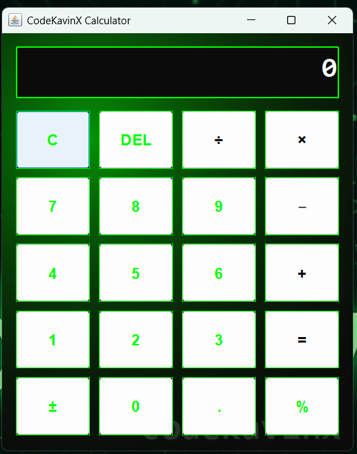

# CodeKavinX Calculator 🖩

A stylish desktop **Calculator App** built in **Java Swing**, themed with **CodeKavinX colors**  
(black, white, neon green #00FF00), and featuring a custom **watermark**.

---

## ✨ Features
- Modern **dark + neon theme** 🎨
- **Basic math operations** (+, −, ×, ÷)
- Extra functions: **%, DEL, C, ±**
- **Custom watermark**: `codekavinx`
- Error handling (e.g. divide by zero)
- Desktop app with **custom icon support**

---

## 🖼 Screenshot
> Here is the CodeKavinX Calculator in action:



---

## 🛠 Technologies
- **Java 21+**
- **Swing (GUI toolkit)**
- **Custom painting with AWT (Neon glow + watermark)**

---

## 🚀 How to Run
1. Clone the repository:
   ```bash
   git clone https://github.com/YOUR_USERNAME/CodeKavinXCalculator.git


## 👨‍💻 Author
**Kavin Karthik**  
💡 Founder of CodeKavinX
   https://codekavinx.com/

---

## 📜 License
This project is open-source under the **MIT License** – free to use & modify.
